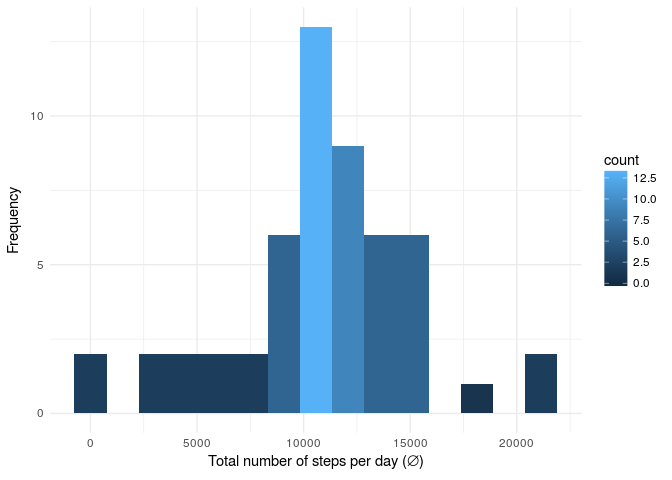
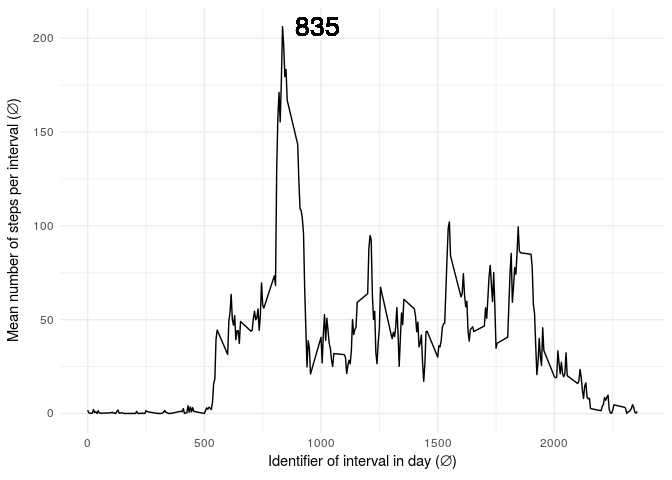

# Reproducible Research: Peer Assessment 1
6RiLM  
8 janvier 2017  


Below is the outcome of my work about the week no 2 of the course **Reproductible Research** on [Coursera](https://www.coursera.org/learn/reproducible-research).
I hope this report will be readable enought. In any case, please tell me everything that sounds wrong to you in order to optimize my working method. Thankx


## Loading and preprocessing the data

Before load this dataset let's first unzip the file in the archive. Data file were given on GitHub repository so we do not have to directly download it.


```r
data.path <- "../../Data/Raw data/"
data.zipFile <- paste(data.path, "activity.zip", sep = "")
unzip(data.zipFile, exdir = data.path)
```

Then let's have a look to this new dataset:  


```r
require(dplyr)
require(data.table)
require(lubridate)

data <- tbl_df(fread(paste(data.path, "activity.csv", sep = ""))) %>%
    mutate(date = ymd(date))
               
head(data, 3)
```

```
## # A tibble: 3 × 3
##   steps       date interval
##   <int>     <date>    <int>
## 1    NA 2012-10-01        0
## 2    NA 2012-10-01        5
## 3    NA 2012-10-01       10
```

This dataset contains **17568 records** described by **3 features**.


## What is mean total number of steps taken per day?

Let's plot an histogram of the total number of steps taken each day.

```r
data <- group_by(data, date)
summary <- summarize(data, total = sum(steps))

require(ggplot2)

fig <- ggplot(summary, aes(total)) +
    geom_histogram(na.rm = T, bins = 15, aes(fill = ..count..)) + 
    theme_minimal() +
    ylab("Frequency") +
    xlab(expression(paste("Total number of steps per day (", symbol("\306"), ")")))
print(fig)
```

<!-- -->

It seems that the average number of steps is close to 10'000. Let's calculate the mean and the median more accurately

```r
mean(summary$total, na.rm = T)
```

```
## [1] 10766.19
```

```r
median(summary$total, na.rm = T)
```

```
## [1] 10765
```

Then this dataset contains steps taken during **61 days** and the **mean number of steps taken each day for that period is about 10766**.


## What is the average daily activity pattern?

Let's now have a look to the mean of the number of steps taken accross all days.

```r
data <- group_by(data, interval)
summary <- summarize(data, mean = mean(steps, na.rm = T))
max <- with(summary, interval[mean == max(mean)])

fig <- ggplot(summary, aes(interval, mean)) +
    geom_line() +
    theme_minimal() +
    geom_text(size = 7,
              aes(label = max),
              x = max + 150,
              y = max(summary$mean)) +
    xlab(expression(paste("Identifier of interval in day (", symbol("\306"), ")"))) + 
    ylab(expression(paste("Mean number of steps per interval (", symbol("\306"), ")")))
print(fig)
```

<!-- -->

Then, as we can see on the picture above, the interval in which the mean number of step is at its maximum is 835. **So, this corresponds to the 5-minute interval after 8:35 AM**.

## Imputing missing values

Let's see how many NA we have for each feature in this dataset.

```r
colSums(sapply(data, is.na))
```

```
##    steps     date interval 
##     2304        0        0
```

```r
# str(data)
```


## Are there differences in activity patterns between weekdays and weekends?
